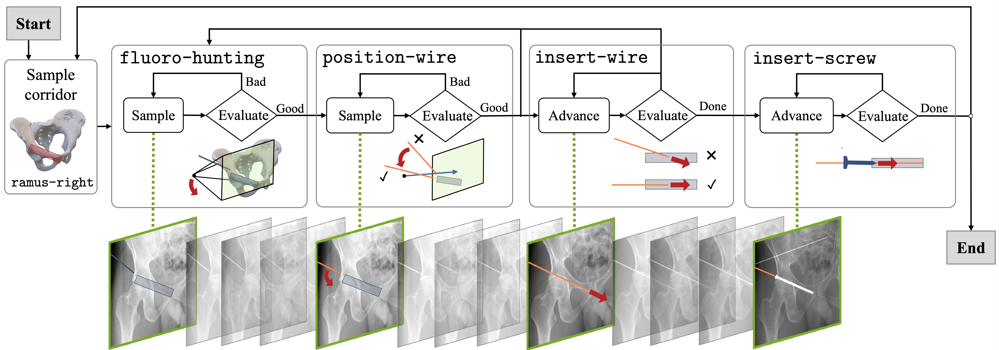
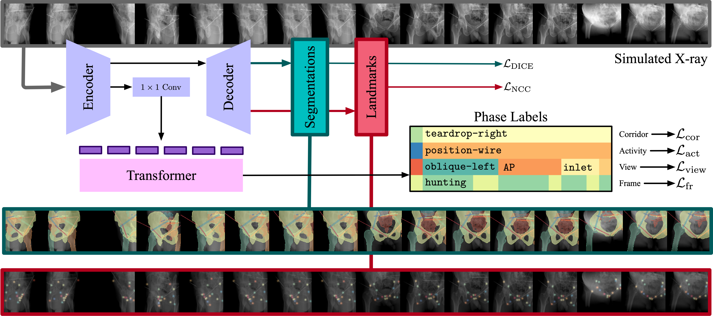

<div align="center">

# Pelphix

Surgical Phase Recognition from X-ray Images in Percutaneous Pelvic Fixation


</div>

<div align="center">

<!-- TODO: update links to the arxiv and dataset links. -->
[](
<https://opensource.org/licenses/Apache-2.0>)
[](
<https://arxiv.org/abs/2109.13900>)
[](
<https://doi.org/10.5281/zenodo.5555555>)

<div align="left">

## Overview

Surgical phase recognition (SPR) is a crucial element in the digital transformation of the modern operating theater. While SPR based on video sources is well-established, incorporation of interventional X-ray sequences has not yet been explored. This paper presents Pelphix, a first approach to SPR for X-ray-guided percutaneous pelvic fracture fixation, which models the procedure at four levels of granularity – corridor, activ- ity, view, and frame value – simulating the pelvic fracture fixation work- flow as a Markov process to provide fully annotated training data. Using added supervision from detection of bony corridors, tools, and anatomy, we learn image representations that are fed into a transformer model to regress surgical phases at the four granularity levels. Our approach demonstrates the feasibility of X-ray-based SPR, achieving an average accuracy of 93.8% on simulated sequences and 67.57% in cadaver across all granularity levels, with up to 88% accuracy for the target corridor in real data. This work constitutes the first step toward SPR for the X-ray domain, establishing an approach to categorizing phases in X-ray-guided surgery, simulating realistic image sequences to enable machine learning model development, and demonstrating that this approach is feasible for the analysis of real procedures. As X-ray-based SPR continues to ma- ture, it will benefit procedures in orthopedic surgery, angiography, and interventional radiology by equipping intelligent surgical systems with situational awareness in the operating room.

If you find this work useful in your research, please consider citing:

```bibtex
TODO: add citation
```

## Data

TODO: add data download instructions from Zenodo, first to the zip folders of the Pelphix datasets.
Provide instructions for obtaining the NMDID data, and maybe link to the nmdid-arcade repo for
processing.

## Installation

Clone the repository:

```bash
git clone git@github.com:benjamindkilleen/pelphix.git
git submodule init
git submodule update
```

Install and activate the conda environment with

```bash
conda env create -f environment.yaml
conda activate pelphix
```

## Usage

### Run Experiments

Individual experiments can be run by specifying the `experiment` argument to `main.py`. For example,

```bash
python main.py experiment={ssm,generate,pretrain,train,test} [options]
```

- `ssm` runs the statistical shape model to propagate annotations.
- `generate` generates simulated datasets for sequences and view-invariant (totally random) sampling.
- `pretrain` pre-trains the model on view-invariant data.
- `train` trains the model on simulated sequences.
- `test` tests the model on simulated sequences and cadaver data.

### Options

See [conf/config.yaml](/conf/config.yaml) for a full list of options. Common variations are:

- `gpus=n` to use `n` GPUs.

## Details






## Known Issues

If an unsuitable trajectory is observed during wire insertion, the state will return to wire
positioning before the wire is actually withdrawn, during which fluoro-hunting may occur.

## TODO

Current bug:

TODO before rebuttal:

- [ ] Add view-invariant pretraining dataset.
  - [ ] Screws and wires in random positions/orientatins in the sphere.
  - [ ] Randomly sample views in 75 degrees around AP, 30 degrees around lateral.
  - [ ] Randomly sample positions in the sphere.
  - [ ] Anatomy segmentations, corridor segmentations, keypoints, wires, screws.
  - [ ] (Maybe) classify views as being from a standard view (and which one) or not, based on a head coming off the U-Net bottom.
  - [ ] Add Keypoints to the tools, just the tip and base.
  - [ ] Make a squite of more realistic K-wires, with threaded tips.
  - [ ] Include all the screws.

- [ ] Fix sequence generation to be more realistic.
  - [ ] When screw is inserted, check it from two views?
  - [ ] Optional: After wire placement, odds of going to corresponding screw placement should be higher.
  - [ ] Optional: "Correct" view might be randomly sampled.
  - [ ] Future work: Fluoro-hunting makes more sense as an activity. This also requires non-hierarchical state machine.
  - [X] Wire is being inserted while in the position_wire mode. Probably because we are continuing after wire insertion without taking an image.
  - [X] Fluoro-hunting should be less pronounced as procedure goes on.
  - [X] New view isn't being sampled when the wire looks good, especially in the middle of insertion.
  - [X] Make sampling more realistic for views/positions (fiddle with bounds, make lower bounds larger, more randomness)
  - [X] First "wire insert" should actually advance the wire.
  - [X] As soon as the wire is fully inserted, move to the next task. (done?)
  - [X] Screw insertion is looping without any advancement.
  - [X] Initial wire positioning is way off, not within 15 degrees of correct.
  - [X] On first wire insert, there appears to also be some wire positioning.
  - [X] Remove `Step` from the Workflow State.
  - [X] Randomly sample task order. Allow screw insertion to be sampled at any time.
  - [X] Limit views for each task to ones actually used.
  - [X] Add missing views (IO, OO)
  - [X] Corridor segmentation should never vary, only the distance along it that wires/screws are inserted.
  - [X] Wire should always go the correct length along the corridor (whatever that is for the given corridor).
  - [X] Don't place the wire at start until no longer in fluoro hunting the desired view is achieved. Same with screw.
  - [X] If we just determined the wire was positioned correctly, don't change the acquisition.
  - [X] Decision to go to wire insertion needs to include likelihood of checking the other view instead. We're at the end of a
  - [X] Choose screw based on insertion fractions, not corridor length.
  - [X] For some reason, the last image with a given view is always "fluoro-hunting."
  - [X] Screw views should not include down-the-barrel (done, not run)
  - [X] Screw advancement should always include a stop with the tip at the bone.
- [ ] Minor model changes
  - [ ] Pre-training step, with `(black, black, frame)` as input.
  - [ ] 3-frame input should be `(prev-prev, prev, current)`, with black for `prev-prev` and `prev` if it doesn't exist.

Maybe TODO (but not deal-breakers):

- [ ] Re-build SSM with new meshes and regularization. (Likely not necessary.)

TODO before journal extension:

- [ ] Update the model to something more advanced, maybe TransUNet
  - [ ] Eventually use SwinTransformer

</div>
